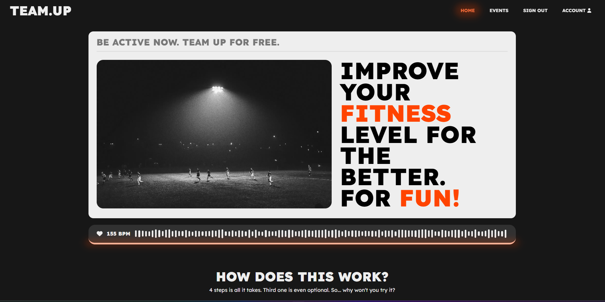
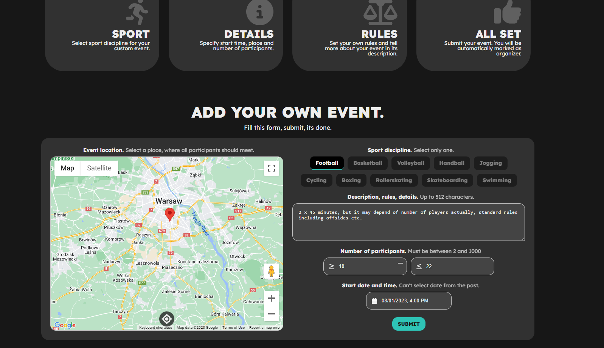
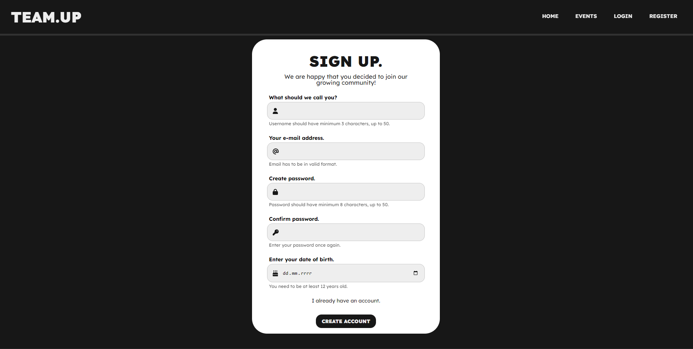

# Team.Up (WIP)

Ever wanted to find a team to play some football or find a partner to go to gym? Team.Up allows you to do so! Create your own sport event or join existing one and keep up your healthy lifestyle!

## Built with
Next.js, React, TypeScript, CSS Modules.

## Features
At this moment only few of mentioned below features are implemented.

### What can user do?
- create account and sign in ✅
- authenticate using JWT and refresh tokens ✅
- browse sport disciplines and sport events ✅
- enroll for the event ⌛
- filter events by sports, popularity, location, time, etc. ⌛
- add, modify or delete own events ⌛
- change username, password, profile picture ⌛

### What can admin do?
- everything user can do ✅
- add, modify or delete sport events ⌛
- add, modify or delete available sport disciplines ✅
- change users roles, suspend users accounts ⌛
- filter users by username or email ⌛


## Backend
Backend was created in Express.js, available at: https://github.com/hejs22/team.up-back


## Instruction

First run `npm install`, then run the development server:

```bash
npm run dev
# or
yarn dev
# or
pnpm dev
```

Open [http://localhost:3000](http://localhost:3000) with your browser to see the result.

## Config
`NEXTAUTH_URL` - Next Auth URL, default: `http://localhost:3000/api/auth`

`NEXTAUTH_SECRET` - Next Auth secret

`NEXT_PUBLIC_GOOGLE_MAPS_API_KEY` - Google Maps API Key, necessary to make maps works.


## Gallery






